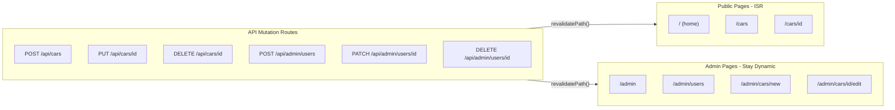

# Cache Implementation Plan

## Current State

Every data-fetching page exports `force-dynamic`, which forces a fresh server render and DB query on **every single request**. There is no client-side or server-side caching of any kind. Two pages (`cars/[id]` and `admin/cars/[id]/edit`) also fetch the same car **twice** per request -- once in `generateMetadata` and once in the page component.

## Strategy



Three layers of caching will be added:

1. **ISR (time-based, 1 hour)** on public pages as a baseline cache — data rarely changes
2. **On-demand revalidation** in API routes so changes appear immediately whenever an admin creates, edits, or deletes anything
3. **React `cache()` deduplication** to eliminate duplicate DB queries within a single request

---

## Phase 1: Deduplicate DB Queries with React `cache()`

Create a new file [`src/lib/queries/cars.ts`](src/lib/queries/cars.ts) that wraps Prisma calls in React's `cache()`. This ensures that when both `generateMetadata` and the page component call the same query in one request, the DB is hit only once.

```typescript
import { cache } from 'react';
import { prisma } from '@/lib/prisma';

export const getCarById = cache(async (id: string) => {
  return prisma.car.findUnique({ where: { id } });
});

export const getAllCars = cache(async () => {
  return prisma.car.findMany({ orderBy: { createdAt: 'desc' } });
});

export const getFeaturedCars = cache(async () => {
  return prisma.car.findMany({
    where: { featured: true },
    orderBy: { createdAt: 'desc' },
    take: 6,
  });
});

export const getLatestCars = cache(async () => {
  return prisma.car.findMany({
    orderBy: { createdAt: 'desc' },
    take: 6,
  });
});
```

**Files to update:**

- [`src/app/[locale]/cars/[id]/page.tsx`](src/app/[locale]/cars/[id]/page.tsx) -- use `getCarById` in both `generateMetadata` and page (eliminates the duplicate query on lines 29 and 46)
- [`src/app/[locale]/admin/cars/[id]/edit/page.tsx`](src/app/[locale]/admin/cars/[id]/edit/page.tsx) -- use `getCarById` in both `generateMetadata` and page (eliminates the duplicate query on lines 18 and 35)
- [`src/app/[locale]/page.tsx`](src/app/[locale]/page.tsx) -- use `getFeaturedCars` and `getLatestCars`
- [`src/app/[locale]/cars/page.tsx`](src/app/[locale]/cars/page.tsx) -- use `getAllCars`
- [`src/app/[locale]/admin/page.tsx`](src/app/[locale]/admin/page.tsx) -- use `getAllCars`

---

## Phase 2: Replace `force-dynamic` with ISR on Public Pages

Remove `export const dynamic = 'force-dynamic'` from public pages and replace with a 1-hour revalidation window. Since inventory data doesn't update often, 1 hour is a safe baseline. On-demand revalidation (Phase 3) will bust the cache instantly whenever an admin makes a change, so users never see truly stale data.

```typescript
export const revalidate = 3600; // revalidate at most every 1 hour
```

| Page         | File                                                                         | Change                                 |
| ------------ | ---------------------------------------------------------------------------- | -------------------------------------- |
| Home         | [`src/app/[locale]/page.tsx`](src/app/[locale]/page.tsx)                     | `force-dynamic` -> `revalidate = 3600` |
| Cars listing | [`src/app/[locale]/cars/page.tsx`](src/app/[locale]/cars/page.tsx)           | `force-dynamic` -> `revalidate = 3600` |
| Car detail   | [`src/app/[locale]/cars/[id]/page.tsx`](src/app/[locale]/cars/[id]/page.tsx) | `force-dynamic` -> `revalidate = 3600` |

**Admin pages stay `force-dynamic`** because they call `auth()` (which reads cookies), making them inherently dynamic. Keeping `force-dynamic` is explicit and correct.

**Remove unnecessary `force-dynamic`** from [`src/app/[locale]/admin/cars/new/page.tsx`](src/app/[locale]/admin/cars/new/page.tsx) -- this page does not fetch car data (only renders a form). The admin layout already handles auth, and the page will be dynamic due to the layout's `auth()` call regardless.

---

## Phase 3: On-Demand Revalidation in API Routes

After every successful mutation, call `revalidatePath()` to immediately bust the cache for affected pages. This ensures admin edits are reflected on public pages instantly — no need to wait for the 1-hour ISR timer to expire.

Create a revalidation helper in [`src/lib/revalidate.ts`](src/lib/revalidate.ts):

```typescript
import { revalidatePath } from 'next/cache';
import { locales } from '@/i18n/config';

export function revalidateCarPages(carId?: string) {
  for (const locale of locales) {
    revalidatePath(`/${locale}`); // home page
    revalidatePath(`/${locale}/cars`); // cars listing
    revalidatePath(`/${locale}/admin`); // admin dashboard
    if (carId) {
      revalidatePath(`/${locale}/cars/${carId}`); // car detail
    }
  }
}

export function revalidateUserPages() {
  for (const locale of locales) {
    revalidatePath(`/${locale}/admin/users`);
  }
}
```

**API routes to update:**

| Route                          | File                                                                             | After                    |
| ------------------------------ | -------------------------------------------------------------------------------- | ------------------------ |
| `POST /api/cars`               | [`src/app/api/cars/route.ts`](src/app/api/cars/route.ts)                         | `revalidateCarPages()`   |
| `PUT /api/cars/[id]`           | [`src/app/api/cars/[id]/route.ts`](src/app/api/cars/[id]/route.ts)               | `revalidateCarPages(id)` |
| `DELETE /api/cars/[id]`        | [`src/app/api/cars/[id]/route.ts`](src/app/api/cars/[id]/route.ts)               | `revalidateCarPages(id)` |
| `POST /api/admin/users`        | [`src/app/api/admin/users/route.ts`](src/app/api/admin/users/route.ts)           | `revalidateUserPages()`  |
| `PATCH /api/admin/users/[id]`  | [`src/app/api/admin/users/[id]/route.ts`](src/app/api/admin/users/[id]/route.ts) | `revalidateUserPages()`  |
| `DELETE /api/admin/users/[id]` | [`src/app/api/admin/users/[id]/route.ts`](src/app/api/admin/users/[id]/route.ts) | `revalidateUserPages()`  |

---

## Summary of All File Changes

| File                                             | What Changes                                                                     |
| ------------------------------------------------ | -------------------------------------------------------------------------------- |
| `src/lib/queries/cars.ts`                        | **New file** -- cached query functions                                           |
| `src/lib/revalidate.ts`                          | **New file** -- revalidation helpers                                             |
| `src/app/[locale]/page.tsx`                      | `force-dynamic` -> `revalidate = 3600`, use cached queries                       |
| `src/app/[locale]/cars/page.tsx`                 | `force-dynamic` -> `revalidate = 3600`, use cached queries                       |
| `src/app/[locale]/cars/[id]/page.tsx`            | `force-dynamic` -> `revalidate = 3600`, use `getCarById` (fixes duplicate query) |
| `src/app/[locale]/admin/page.tsx`                | Use cached `getAllCars` query                                                    |
| `src/app/[locale]/admin/cars/new/page.tsx`       | Remove unnecessary `force-dynamic`                                               |
| `src/app/[locale]/admin/cars/[id]/edit/page.tsx` | Use `getCarById` (fixes duplicate query)                                         |
| `src/app/api/cars/route.ts`                      | Add `revalidateCarPages()` after POST                                            |
| `src/app/api/cars/[id]/route.ts`                 | Add `revalidateCarPages(id)` after PUT and DELETE                                |
| `src/app/api/admin/users/route.ts`               | Add `revalidateUserPages()` after POST                                           |
| `src/app/api/admin/users/[id]/route.ts`          | Add `revalidateUserPages()` after PATCH and DELETE                               |
