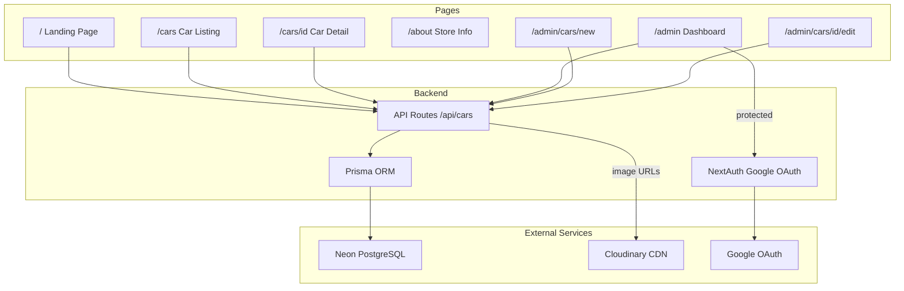

# Car Dealership Website

## Tech Stack

| Layer      | Technology                   | Why                                                 |
| ---------- | ---------------------------- | --------------------------------------------------- |
| Framework  | **Next.js 14 (App Router)**  | SSR, API routes, file-based routing                 |
| Database   | **PostgreSQL on Neon**       | Free serverless Postgres, great Vercel integration  |
| ORM        | **Prisma**                   | Type-safe database access, migrations               |
| Auth       | **NextAuth.js v5 (Auth.js)** | Google OAuth with minimal config                    |
| Images     | **Cloudinary**               | Free tier (25 GB), upload widget, auto-optimization |
| Styling    | **Tailwind CSS + shadcn/ui** | Modern, responsive, accessible components           |
| Deployment | **Vercel**                   | Zero-config Next.js hosting                         |

## Database Schema

```prisma
model Car {
  id           String   @id @default(cuid())
  make         String
  model        String
  year         Int
  price        Float
  mileage      Int
  fuelType     String
  transmission String
  color        String
  description  String
  images       String[]
  featured     Boolean  @default(false)
  createdAt    DateTime @default(now())
  updatedAt    DateTime @updatedAt
}
```

## Architecture



## Pages Breakdown

### 1. Landing Page (`/`)

- Hero section with dealership branding
- Featured cars gallery (cars marked as `featured: true`)
- Brief card for each car: image, make/model, year, price
- Call-to-action buttons linking to `/cars` and `/about`

### 2. Cars Page (`/cars`)

- Grid of all cars with responsive layout
- Each card shows: main image, make, model, year, price, mileage
- Click through to individual car detail page

### 3. Car Detail Page (`/cars/[id]`)

- Image gallery/carousel
- Full details: make, model, year, price, mileage, fuel type, transmission, color
- Description text
- Back to listing button

### 4. About / Contact Page (`/about`)

- Store information (hardcoded): name, address, phone, email, business hours
- Embedded Google Maps iframe for location
- Contact section

### 5. Admin Dashboard (`/admin`) -- Protected by Google Auth

- List of all cars in a table/card view
- Add new car button
- Edit and delete buttons per car
- Cloudinary upload widget for car images

### 6. Admin Car Form (`/admin/cars/new` and `/admin/cars/[id]/edit`)

- Form fields for all car properties
- Cloudinary image upload widget (multi-image)
- Featured toggle
- Save / Cancel actions

## API Routes

| Method | Route            | Description                |
| ------ | ---------------- | -------------------------- |
| GET    | `/api/cars`      | List all cars              |
| GET    | `/api/cars/[id]` | Get single car             |
| POST   | `/api/cars`      | Create car (auth required) |
| PUT    | `/api/cars/[id]` | Update car (auth required) |
| DELETE | `/api/cars/[id]` | Delete car (auth required) |

## Key Files Structure

```
app/
  layout.tsx              -- Root layout with navbar
  page.tsx                -- Landing page
  cars/
    page.tsx              -- Cars listing
    [id]/page.tsx         -- Car detail
  about/page.tsx          -- Store info + contacts
  admin/
    layout.tsx            -- Admin layout with auth guard
    page.tsx              -- Admin dashboard
    cars/
      new/page.tsx        -- Add car form
      [id]/edit/page.tsx  -- Edit car form
  api/
    auth/[...nextauth]/route.ts
    cars/route.ts
    cars/[id]/route.ts
components/
  Navbar.tsx
  CarCard.tsx
  CarForm.tsx
  ImageUpload.tsx
  Hero.tsx
  Footer.tsx
lib/
  prisma.ts               -- Prisma client singleton
  auth.ts                  -- NextAuth config
  cloudinary.ts            -- Cloudinary config
prisma/
  schema.prisma
```

## Prerequisites (user must provide before running)

1. **Neon database** -- create a free project at [neon.tech](https://neon.tech) and get the `DATABASE_URL`
2. **Google OAuth credentials** -- create at [Google Cloud Console](https://console.cloud.google.com) (OAuth 2.0 Client ID)
3. **Cloudinary account** -- get cloud name, API key, and API secret from [cloudinary.com](https://cloudinary.com)

These will go into a `.env` file (a `.env.example` will be provided as a template).
