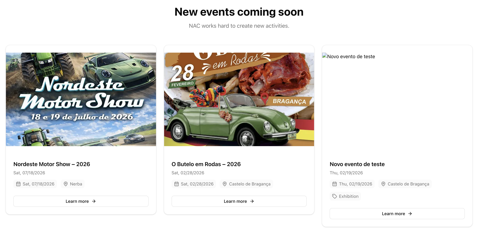
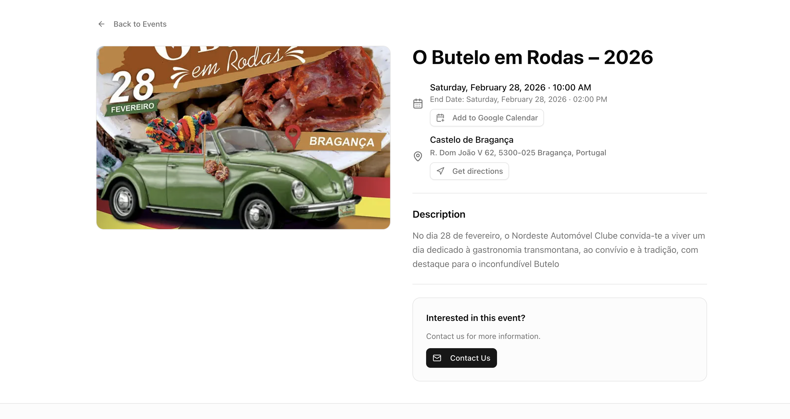
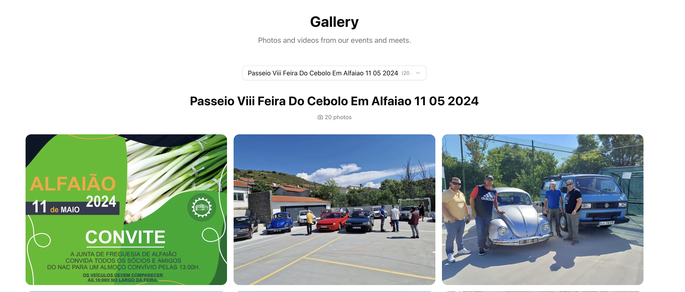
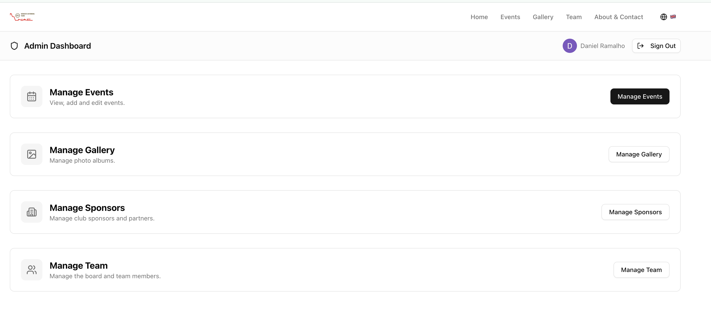

# Events Club

A multi-language club website built with **Next.js 15 (App Router)**, **Prisma**, **Tailwind CSS v4**, and **shadcn/ui**. Originally built for [Nordeste Automóvel Clube](https://www.nordesteautomovelclube.pt), the codebase is designed to be forked and re-skinned for any club or association by editing a single config file.

## Screenshots

| Home | Events | Event Detail |
|:---:|:---:|:---:|
|  |  |  |

| Gallery | Admin Panel |
|:---:|:---:|
|  |  |

> Add screenshots to `docs/screenshots/` to populate the table above.

## Features

- **Events** — list, detail, and full CRUD admin for upcoming and past events, with Google Calendar and external registration link support
- **Gallery** — photo/video albums synced from Cloudinary; admin for browsing and editing metadata
- **Team** — meet-the-team page with sortable member profiles
- **Admin panel** — role-based access (user / manager / admin) protected by Google OAuth via NextAuth.js v5
- **Internationalisation** — four locales out of the box: Portuguese (`pt` default), English, Spanish, French
- **Location autocomplete** — Google Maps / Places API integration on event forms
- **One config to rule them all** — `src/config/site.ts` holds all brand-specific values (name, logo, contact info, routes)

## Tech Stack

| Layer | Technology |
|---|---|
| Framework | Next.js 16 (App Router) |
| Language | TypeScript 5 |
| Database ORM | Prisma 7 (PostgreSQL) |
| Auth | NextAuth.js v5 (Google provider) |
| Styling | Tailwind CSS v4 + shadcn/ui + Radix UI |
| Media | Cloudinary |
| Validation | Zod 4 |
| i18n | Custom dictionary-based (no extra lib) |

## Prerequisites

- Node.js 20+
- PostgreSQL database (local or hosted — e.g. Neon, Supabase, Railway)
- Cloudinary account
- Google Cloud project with **OAuth 2.0** credentials and **Maps JavaScript API** + **Places API** enabled

## Getting Started

### 1. Clone and install

```bash
git clone <repo-url>
cd events-club
npm install
```

### 2. Configure environment variables

Copy the example file and fill in each value:

```bash
cp .env.example .env
```

| Variable | Description |
|---|---|
| `DATABASE_URL` | PostgreSQL connection string |
| `PRISMA` | Prisma Postgres API key (if using Prisma managed DB) |
| `NEXT_PUBLIC_CLOUDINARY_CLOUD_NAME` | Cloudinary cloud name |
| `NEXT_PUBLIC_CLOUDINARY_UPLOAD_PRESET` | Unsigned upload preset |
| `CLOUDINARY_API_KEY` | Cloudinary API key |
| `CLOUDINARY_API_SECRET` | Cloudinary API secret |
| `AUTH_SECRET` | Random secret for NextAuth (run `openssl rand -base64 32`) |
| `GOOGLE_CLIENT_ID` | Google OAuth client ID |
| `GOOGLE_CLIENT_SECRET` | Google OAuth client secret |
| `SEED_ADMIN_EMAIL` | Email address granted admin role on first seed |
| `NEXT_PUBLIC_GOOGLE_MAPS_API_KEY` | Google Maps API key (for location autocomplete) |

### 3. Set up the database

```bash
npx prisma migrate deploy
npm run seed
```

### 4. Run the development server

```bash
npm run dev
```

Open [http://localhost:3000](http://localhost:3000) in your browser.

## Available Scripts

| Script | Description |
|---|---|
| `npm run dev` | Start the development server |
| `npm run build` | Generate Prisma client and build for production |
| `npm run start` | Start the production server |
| `npm run lint` | Run ESLint |
| `npm run format` | Auto-format all files with Prettier |
| `npm run format:check` | Check formatting without writing changes |
| `npm run seed` | Seed the database (creates admin user) |
| `npm run import-events` | Import events from `public/events2.json` |
| `npm run import-members` | Import team members from `members.json` |
| `npm run sync-gallery` | Sync gallery albums from Cloudinary |

## Project Structure

```
src/
├── app/
│   ├── [locale]/          # Locale-aware public & admin pages
│   │   ├── admin/         # Admin panel (events, gallery, team, users, sponsors)
│   │   ├── events/        # Public events list & detail
│   │   ├── gallery/       # Public gallery list & album detail
│   │   ├── team/          # Meet the team
│   │   └── about/         # About / contact page
│   └── api/               # REST API routes (events, gallery, team, auth, admin)
├── components/            # Shared UI components
├── config/
│   └── site.ts            # ← Brand configuration (start here when forking)
├── i18n/
│   ├── config.ts          # Supported locales
│   └── dictionaries/      # Translation files (pt, en, es, fr)
├── lib/
│   ├── queries/           # Prisma query helpers
│   └── validations/       # Zod schemas
└── types/                 # Shared TypeScript types
prisma/
├── schema.prisma          # Database models (Event, GalleryAlbum, User, TeamMember)
├── migrations/            # SQL migration history
└── seed.ts                # Database seeder
scripts/                   # One-off data import & sync utilities
```

## Forking for a New Club

1. Edit `src/config/site.ts` — update `brandName`, `brandIcon`, and `contact` details.
2. Replace `src/components/Logo.tsx` with the new club's logo.
3. Update `.env` with the new club's credentials.
4. Run `npm run seed` to create the first admin user.

Everything else — pages, API routes, admin panel — adapts automatically through the config.

## Internationalisation

The default locale is **Portuguese (`pt`)**. Translations live in `src/i18n/dictionaries/`. To add a new language:

1. Add the locale code to the `locales` array in `src/i18n/config.ts`.
2. Create `src/i18n/dictionaries/<locale>.json` by copying and translating `en.json`.

## Deployment

The project is optimised for deployment on **Vercel**:

1. Push the repository to GitHub.
2. Import the project in [Vercel](https://vercel.com/new).
3. Set all environment variables from `.env.example` in the Vercel dashboard.
4. Vercel will run `npm run build` (`prisma generate && next build`) automatically.

For other platforms, ensure the `DATABASE_URL` is accessible at build time so Prisma can generate the client.
